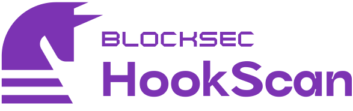

# HookScan



[](LICENSE)
[](https://github.com/blocksecteam/hookscan/actions/workflows/ci.yml)
[](https://github.com/blocksecteam/hookscan/actions/workflows/build-image.yml)

HookScan is an automated static analyzer designed specifically for [Uniswap v4](https://blog.uniswap.org/uniswap-v4) hooks.
Its purpose is to identify the most prevalent and severe vulnerabilities within Uniswap v4 hooks that are susceptible to malicious manipulation. The security model and design of HookScan draw from insights detailed in a series of our published articles:

- [Thorns in the Rose: Exploring Security Risks in Uniswap v4's Novel Hook Mechanism](https://phalcon.xyz/blog/thorns-in-the-rose-exploring-security-risks-in-uniswap-v4-s-novel-hook-mechanism)
- [Lethal Integration: Vulnerabilities in Hooks Due to Risky Interactions](https://phalcon.xyz/blog/lethal-integration-vulnerabilities-in-hooks-due-to-risky-interactions)
- Malicious Hooks (TBA)

HookScan is based on a simplified tailored version of **Phalcon Inspector**, a powerful static analysis framework developed by [BlockSec](https://blocksec.com/).
Phalcon Inspector is still under development and will be open-sourced and announced in the future.

## Get started

### Prerequisite

```bash
solc>=0.8.14
python>=3.8

pip install -r requirements.txt
```

### Usage

```bash
# [optional] for foundry projects, fetch dependencies before running HookScan
forge install --root path/to/foundry/project

# simple usage
PYTHONPATH=path/to/this/repo python -m hookscan path/to/source_file.sol:ContractName

# help
PYTHONPATH=path/to/this/repo python -m hookscan --help
```

<details>
<summary>
<h3>Docker Support</h3>
</summary>

HookScan provides docker support with python and solc dependency integrated.

```bash
# build image
docker build --tag hookscan .

# pull pre-built image
docker pull futuretech6/hookscan
docker image tag futuretech6/hookscan hookscan

# run image
docker run --rm -it \
    -v /path/to/project:/project \
    -e SOLC_VERSION=0.8.x \
    -e CONTRACT=path/to/source_file.sol:ContractName \
    hookscan [--other-flags]

# demo: run image on v4-stoploss (https://github.com/saucepoint/v4-stoploss)
git clone https://github.com/saucepoint/v4-stoploss ~/v4-stoploss
forge install --root ~/v4-stoploss
docker run --rm -it \
    -v $HOME/v4-stoploss:/project \
    -e SOLC_VERSION=0.8.19 \
    -e CONTRACT=src/StopLoss.sol:StopLoss \
    hookscan
```

</details>

## Detector Spec

| **Detector**                               | **Description**                                                                          | **Severity** | **Confidence** |
| ------------------------------------------ | ---------------------------------------------------------------------------------------- | ------------ | -------------- |
| [`UniswapPublicHook`][public_hook]         | callers of hook functions are not exclusively<br />restricted to the pool manager alone  | High         | High           |
| [`UniswapPublicCallback`][public_callback] | callers of callback functions are not exclusively<br />restricted to the contract itself | High         | High           |
| [`UniswapUpgradableHook`][upgradable_hook] | the contract `DELEGATECALL`s to mutable addresses                                        | High         | High           |
| [`UniswapSuicidalHook`][suicidal_hook]     | the contract contains `SELFDESTRUCT`                                                     | Medium       | High           |
| [`UniswapRugHook`][rug_hook]               | the hook is a possible rug pull contract                                                 | High         | Medium         |

## Evaluation

We've conducted tests on 13 hook contracts associated with Uniswap v4, as listed in the compilation [awesome-uniswap-hook](https://github.com/hyperoracle/awesome-uniswap-hooks), all of which compiled without errors.
The test results are as follows:

| **Detector**                               | **TP/ground_truth** |
| ------------------------------------------ | ------------------- |
| [`UniswapPublicHook`][public_hook]         | 7/7 contracts       |
| [`UniswapPublicCallback`][public_callback] | 3/3 contracts       |
| [`UniswapUpgradableHook`][upgradable_hook] | 0                   |
| [`UniswapSuicidalHook`][suicidal_hook]     | 0                   |
| [`UniswapRugHook`][rug_hook]               | N/A                 |

## Note

HookScan can be integrated into the development process to scan Uniswap v4 hooks. Specifically, it can be used to determine whether these hooks are vulnerable or malicious, using the security models described in our previously mentioned published articles.

Using HookScan can significantly reduce manual effort and help to locate many potential issues. Nonetheless, HookScan has its limitations, particularly with complex logical vulnerabilities or those related to semantics.

To uncover and address these sophisticated semantic concerns, the expertise of BlockSec's seasoned professionals is indispensable. They can conduct thorough and detailed reviews to ensure the highest level of security. For our comprehensive audit services and proactive security solutions, such as [Phalcon Block](https://phalcon.xyz/block), to protect your smart contracts and assets, please do not hesitate to contact us.

## License

This project is under the AGPLv3 License. See the LICENSE file for the full license text.

[public_callback]: docs/detectors/UniswapPublicCallback.md
[public_hook]: docs/detectors/UniswapPublicHook.md
[upgradable_hook]: docs/detectors/UniswapUpgradableHook.md
[suicidal_hook]: docs/detectors/UniswapSuicidalHook.md
[rug_hook]: docs/detectors/UniswapRugHook.md
